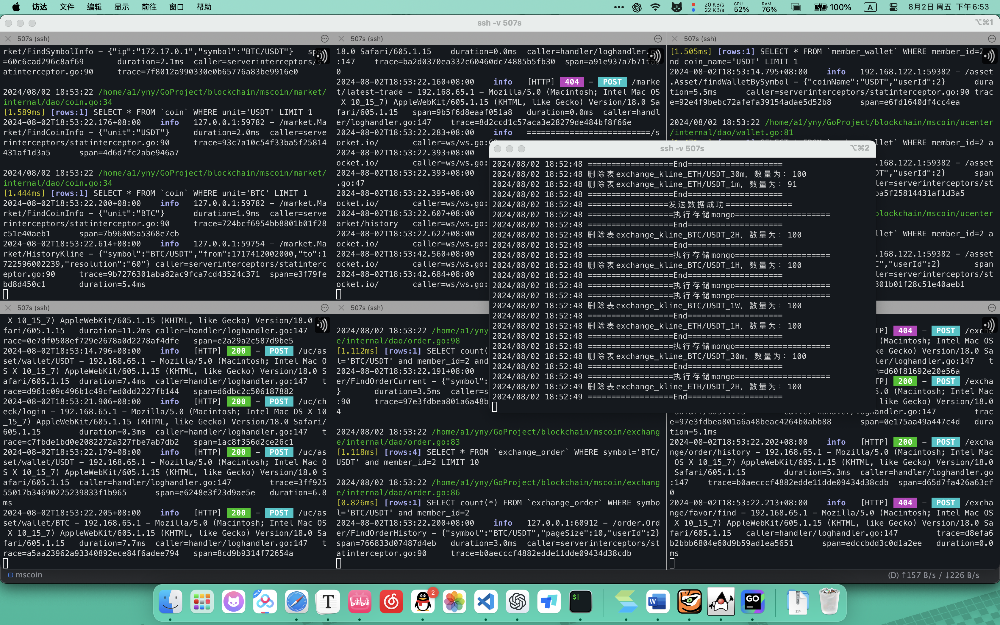

# 区块链交易平台-Blockchain-txPlatform-mszlu

按照[码神之路](https://www.mszlu.com)编写的区块链交易平台

## 1 效果展示

### 1.1 前端效果

#### 1.1.1 首页：


#### 1.1.2 个人中心


#### 1.1.3 充币


#### 1.1.4 市场


### 1.2 后端效果



## 2 准备

### 2.1 后端准备

1. docker
2. mysql:8.0.20
3. redis:6.2.7
4. bitnami/etcd:3.5.6       
5. mongo:4.2.1 
6. nginx
7. obsidiandynamics/kafka

### 2.2 前端准备

1. npm:6.14.16
2. Nodjs:14.19.0


## 3 启动

### 3.1 前端部分：

- 启动前端：在前端根目录使用命令：`npm run dev`，将在`localhost:8080`启动项目前端界面

### 3.2 后端部分：

启动容器：首先在寻找合适的路径配置相关容器会使用到的路径，参考配置：

```shell
.
├── etcd
│   └── data
├── mongo
│   ├── db
│   └── log
├── mysql
│   ├── conf
│   ├── data
│   └── logs
├── nginx
│   ├── config
│   └── logs
└── redis
    ├── conf
    └── data
```

> 如果遇到某些容器无法启动，尝试将对应映射路径的权限提高为`777`

随在后端根目录使用命令：`docker compose up -d`启动`docker-compose.yml`中定义的容器

#### 3.2.1 nginx配置

在nginx里配置相应路由，从而对外隐藏端口。由于需要访问80端口，因此需要线进入nginx容器内部，删除`default.conf`：

```shell
docker exec -it mscoin-nginx bash
cp /etc/nginx/conf.d/default.conf /etc/nginx/conf.d/default.conf.bak
rm /etc/nginx/conf.d/default.conf
```

修改nginx路由配置：

```nginx
// ...
http {
    // ...
        
    server {
        listen       80;
        server_name  localhost;
 
    error_page   500 502 503 504  /50x.html;
        location = /50x.html { 
            root   html;
        }

    location /uc {
        client_max_body_size    5m;
        proxy_pass http://172.17.0.1:8888;
        proxy_set_header Host $host;
        proxy_set_header X-Real-IP $remote_addr;
    }  

    location /market {
        client_max_body_size    5m;
        proxy_pass http://172.17.0.1:8889;
        proxy_set_header Host $http_host;
        proxy_set_header X-Real-IP $remote_addr;
        proxy_set_header X-Scheme $scheme;
        proxy_set_header Upgrade $http_upgrade;
        proxy_set_header Connection "upgrade";
    }

    location /socket.io/ {
        proxy_pass http://172.17.0.1:8889;
        proxy_http_version 1.1;
        proxy_set_header Upgrade $http_upgrade;
        proxy_set_header Connection "upgrade";
        proxy_set_header Host $host;
        proxy_set_header Access-Control-Allow-Origin *;
        proxy_set_header Access-Control-Allow-Methods "GET, POST, OPTIONS";
        proxy_set_header Access-Control-Allow-Headers "Origin, X-Requested-With, Content-Type, Accept";
    }

    location /exchange {
        client_max_body_size    5m;
        proxy_pass http://172.17.0.1:8890;
        proxy_set_header Host $host;
        proxy_set_header X-Real-IP $remote_addr;
    }
}
}

```

其中，地址`172.17.0.1`为docker容器网关（即宿主机）对应ip，应修改为自己对应的ip

#### 3.2.2 mysql配置

在mysql中创建`zero_mall`、`market`、`exchange`三个数据库，并在三个数据库中分别创建以下表：
```mysql
-- Active: 1722220945514@@127.0.0.1@3309@zero_mall
CREATE TABLE `member`  (
  `id` bigint(20) NOT NULL AUTO_INCREMENT,
  `ali_no` varchar(256) CHARACTER SET utf8 COLLATE utf8_general_ci NOT NULL,
  `qr_code_url` varchar(256) CHARACTER SET utf8 COLLATE utf8_general_ci NOT NULL,
  `appeal_success_times` int(0) NOT NULL,
  `appeal_times` int(0) NOT NULL,
  `application_time` bigint(0) NOT NULL,
  `avatar` varchar(256) CHARACTER SET utf8 COLLATE utf8_general_ci NOT NULL,
  `bank` varchar(256) CHARACTER SET utf8 COLLATE utf8_general_ci NOT NULL,
  `branch` varchar(256) CHARACTER SET utf8 COLLATE utf8_general_ci NOT NULL,
  `card_no` varchar(256) CHARACTER SET utf8 COLLATE utf8_general_ci NOT NULL,
  `certified_business_apply_time` bigint(0) NOT NULL,
  `certified_business_check_time` bigint(0) NOT NULL,
  `certified_business_status` int(0) NOT NULL,
  `channel_id` int(0) NOT NULL DEFAULT 0,
  `email` varchar(256) CHARACTER SET utf8 COLLATE utf8_general_ci NOT NULL,
  `first_level` int(0) NOT NULL,
  `google_date` bigint(0) NOT NULL,
  `google_key` varchar(256) CHARACTER SET utf8 COLLATE utf8_general_ci NOT NULL,
  `google_state` int(0) NOT NULL DEFAULT 0,
  `id_number` varchar(256) CHARACTER SET utf8 COLLATE utf8_general_ci NOT NULL,
  `inviter_id` bigint(0) NOT NULL,
  `is_channel` int(0) NOT NULL DEFAULT 0,
  `jy_password` varchar(256) CHARACTER SET utf8 COLLATE utf8_general_ci NOT NULL,
  `last_login_time` bigint(0) NOT NULL,
  `city` varchar(256) CHARACTER SET utf8 COLLATE utf8_general_ci NOT NULL,
  `country` varchar(256) CHARACTER SET utf8 COLLATE utf8_general_ci NOT NULL,
  `district` varchar(256) CHARACTER SET utf8 COLLATE utf8_general_ci NOT NULL,
  `province` varchar(256) CHARACTER SET utf8 COLLATE utf8_general_ci NOT NULL,
  `login_count` int(0) NOT NULL,
  `login_lock` int(0) NOT NULL,
  `margin` varchar(256) CHARACTER SET utf8 COLLATE utf8_general_ci NOT NULL,
  `member_level` int(0) NOT NULL,
  `mobile_phone` varchar(256) CHARACTER SET utf8 COLLATE utf8_general_ci NOT NULL,
  `password` varchar(256) CHARACTER SET utf8 COLLATE utf8_general_ci NOT NULL,
  `promotion_code` varchar(256) CHARACTER SET utf8 COLLATE utf8_general_ci NOT NULL,
  `publish_advertise` int(0) NOT NULL,
  `real_name` varchar(256) CHARACTER SET utf8 COLLATE utf8_general_ci NOT NULL,
  `real_name_status` int(0) NOT NULL,
  `registration_time` bigint(0) NOT NULL,
  `salt` varchar(256) CHARACTER SET utf8 COLLATE utf8_general_ci NOT NULL,
  `second_level` int(0) NOT NULL,
  `sign_in_ability` tinyint(4) NOT NULL DEFAULT b'1',
  `status` int(0) NOT NULL,
  `third_level` int(0) NOT NULL,
  `token` varchar(256) CHARACTER SET utf8 COLLATE utf8_general_ci NOT NULL,
  `token_expire_time` bigint(0) NOT NULL,
  `transaction_status` int(0) NOT NULL,
  `transaction_time` bigint(0) NOT NULL,
  `transactions` int(0) NOT NULL,
  `username` varchar(256) CHARACTER SET utf8 COLLATE utf8_general_ci NOT NULL,
  `qr_we_code_url` varchar(256) CHARACTER SET utf8 COLLATE utf8_general_ci NOT NULL,
  `wechat` varchar(256) CHARACTER SET utf8 COLLATE utf8_general_ci NOT NULL,
  `local` varchar(256) CHARACTER SET utf8 COLLATE utf8_general_ci NOT NULL,
  `integration` bigint(0) NOT NULL DEFAULT 0,
  `member_grade_id` bigint(0) NOT NULL DEFAULT 1 COMMENT '等级id',
  `kyc_status` int(0) NOT NULL DEFAULT 0 COMMENT 'kyc等级',
  `generalize_total` bigint(0) NOT NULL DEFAULT 0 COMMENT '注册赠送积分',
  `inviter_parent_id` bigint(0) NOT NULL DEFAULT 0,
  `super_partner` varchar(256) CHARACTER SET utf8 COLLATE utf8_general_ci NOT NULL,
  `kick_fee` decimal(19, 2) NOT NULL,
  `power` decimal(8, 4) NOT NULL DEFAULT 0.0000 COMMENT '个人矿机算力(每日维护)',
  `team_level` int(0) NOT NULL DEFAULT 0 COMMENT '团队人数(每日维护)',
  `team_power` decimal(8, 4) NOT NULL DEFAULT 0.0000 COMMENT '团队矿机算力(每日维护)',
  `member_level_id` bigint(0) NOT NULL,
  PRIMARY KEY (`id`) USING BTREE,
  UNIQUE INDEX `UK_gc3jmn7c2abyo3wf6syln5t2i`(`username`) USING BTREE,
  UNIQUE INDEX `UK_10ixebfiyeqolglpuye0qb49u`(`mobile_phone`) USING BTREE,
  INDEX `FKbt72vgf5myy3uhygc90xna65j`(`local`) USING BTREE,
  INDEX `FK8jlqfg5xqj5epm9fpke6iotfw`(`member_level_id`) USING BTREE
) ENGINE = InnoDB AUTO_INCREMENT = 1 CHARACTER SET = utf8mb4 COLLATE = utf8mb4_unicode_ci ROW_FORMAT = Dynamic;

CREATE TABLE exchange_coin  (
  `id` bigint(0) NOT NULL AUTO_INCREMENT,
  `symbol` varchar(255) CHARACTER SET utf8mb3 COLLATE utf8mb3_general_ci NOT NULL COMMENT '交易币种名称，格式：BTC/USDT',
  `base_coin_scale` int(0) NOT NULL COMMENT '基币小数精度',
  `base_symbol` varchar(255) CHARACTER SET utf8mb3 COLLATE utf8mb3_general_ci NOT NULL COMMENT '结算币种符号，如USDT',
  `coin_scale` int(0) NOT NULL COMMENT '交易币小数精度',
  `coin_symbol` varchar(255) CHARACTER SET utf8mb3 COLLATE utf8mb3_general_ci NOT NULL COMMENT '交易币种符号',
  `enable` int(0) NOT NULL COMMENT '状态，1：启用，2：禁止',
  `fee` decimal(8, 4) NOT NULL COMMENT '交易手续费',
  `sort` int(0) NOT NULL COMMENT '排序，从小到大',
  `enable_market_buy` int(0) NOT NULL DEFAULT 1 COMMENT '是否启用市价买',
  `enable_market_sell` int(0) NOT NULL DEFAULT 1 COMMENT '是否启用市价卖',
  `min_sell_price` decimal(18, 8) NOT NULL DEFAULT 0.00000000 COMMENT '最低挂单卖价',
  `flag` int(0) NOT NULL DEFAULT 0 COMMENT '标签位，用于推荐，排序等,默认为0，1表示推荐',
  `max_trading_order` int(0) NOT NULL DEFAULT 0 COMMENT '最大允许同时交易的订单数，0表示不限制',
  `max_trading_time` int(0) NOT NULL DEFAULT 0 COMMENT '委托超时自动下架时间，单位为秒，0表示不过期',
  `min_turnover` decimal(18, 8) NOT NULL DEFAULT 0.00000000 COMMENT '最小挂单成交额',
  `clear_time` bigint(0) NOT NULL DEFAULT 0 COMMENT '清盘时间',
  `end_time` bigint(0) NOT NULL DEFAULT 0 COMMENT '结束时间',
  `exchangeable` int(0) NOT NULL DEFAULT 1 COMMENT ' 是否可交易',
  `max_buy_price` decimal(18, 8) NOT NULL DEFAULT 0.00000000 COMMENT '最高买单价',
  `max_volume` decimal(18, 8) NOT NULL DEFAULT 0.00000000 COMMENT '最大下单量',
  `min_volume` decimal(18, 8) NOT NULL DEFAULT 0.00000000 COMMENT '最小下单量',
  `publish_amount` decimal(18, 8) NOT NULL DEFAULT 0.00000000 COMMENT ' 活动发行数量',
  `publish_price` decimal(18, 8) NOT NULL DEFAULT 0.00000000 COMMENT ' 分摊发行价格',
  `publish_type` int(0) NOT NULL DEFAULT 1 COMMENT '发行活动类型 1:无活动,2:抢购发行,3:分摊发行',
  `robot_type` int(0) NOT NULL DEFAULT 0 COMMENT '机器人类型',
  `start_time` bigint(0) NOT NULL DEFAULT 0 COMMENT '开始时间',
  `visible` int(0) NOT NULL DEFAULT 1 COMMENT ' 前台可见状态',
  `zone` int(0) NOT NULL DEFAULT 0 COMMENT '交易区域',
  PRIMARY KEY (`id`) USING BTREE
) ENGINE = InnoDB CHARACTER SET = utf8mb3 COLLATE = utf8mb3_general_ci ROW_FORMAT = DYNAMIC;

CREATE TABLE `coin`  (
  `id` int(0) NOT NULL AUTO_INCREMENT,
  `name` varchar(255) CHARACTER SET utf8mb3 COLLATE utf8mb3_general_ci NOT NULL COMMENT '货币',
  `can_auto_withdraw` int(0) NOT NULL COMMENT '是否能自动提币',
  `can_recharge` int(0) NOT NULL COMMENT '是否能充币',
  `can_transfer` int(0) NOT NULL COMMENT '是否能转账',
  `can_withdraw` int(0) NOT NULL COMMENT '是否能提币',
  `cny_rate` double NOT NULL COMMENT '对人民币汇率',
  `enable_rpc` int(0) NOT NULL COMMENT '是否支持rpc接口',
  `is_platform_coin` int(0) NOT NULL COMMENT '是否是平台币',
  `max_tx_fee` double NOT NULL COMMENT '最大提币手续费',
  `max_withdraw_amount` decimal(18, 8) NOT NULL COMMENT '最大提币数量',
  `min_tx_fee` double NOT NULL COMMENT '最小提币手续费',
  `min_withdraw_amount` decimal(18, 8) NOT NULL COMMENT '最小提币数量',
  `name_cn` varchar(255) CHARACTER SET utf8mb3 COLLATE utf8mb3_general_ci NOT NULL COMMENT '中文名称',
  `sort` int(0) NOT NULL COMMENT '排序',
  `status` tinyint(0) NOT NULL COMMENT '状态 0 正常 1非法',
  `unit` varchar(255) CHARACTER SET utf8mb3 COLLATE utf8mb3_general_ci NOT NULL COMMENT '单位',
  `usd_rate` double NOT NULL COMMENT '对美元汇率',
  `withdraw_threshold` decimal(18, 8) NOT NULL COMMENT '提现阈值',
  `has_legal` tinyint(1) NOT NULL DEFAULT 0 COMMENT '是否是合法币种',
  `cold_wallet_address` varchar(255) CHARACTER SET utf8mb3 COLLATE utf8mb3_general_ci NOT NULL COMMENT '冷钱包地址',
  `miner_fee` decimal(18, 8) NOT NULL DEFAULT 0.00000000 COMMENT '转账时付给矿工的手续费',
  `withdraw_scale` int(0) NOT NULL DEFAULT 4 COMMENT '提币精度',
  `account_type` int(0) NOT NULL DEFAULT 0 COMMENT '币种账户类型0：默认  1：EOS类型',
  `deposit_address` varchar(255) CHARACTER SET utf8mb3 COLLATE utf8mb3_general_ci NOT NULL COMMENT '充值地址',
  `infolink` varchar(255) CHARACTER SET utf8mb3 COLLATE utf8mb3_general_ci NOT NULL COMMENT '币种资料链接',
  `information` varchar(255) CHARACTER SET utf8mb3 COLLATE utf8mb3_general_ci NOT NULL COMMENT '币种简介',
  `min_recharge_amount` decimal(18, 8) NOT NULL COMMENT '最小充值数量',
  PRIMARY KEY (`id`) USING BTREE
) ENGINE = InnoDB AUTO_INCREMENT = 9 CHARACTER SET = utf8mb3 COLLATE = utf8mb3_general_ci ROW_FORMAT = DYNAMIC;


CREATE TABLE `member_wallet`  (
  `id` bigint(0) NOT NULL AUTO_INCREMENT,
  `address` varchar(255) CHARACTER SET utf8mb3 COLLATE utf8mb3_general_ci NOT NULL COMMENT '充值地址',
  `balance` decimal(18, 8) NOT NULL COMMENT '可用余额',
  `frozen_balance` decimal(18, 8) NOT NULL COMMENT '冻结余额',
  `release_balance` decimal(18, 8) NOT NULL COMMENT '待释放余额',
  `is_lock` int(0) NOT NULL DEFAULT 0 COMMENT '钱包不是锁定 0 否 1 是',
  `member_id` bigint(0) NOT NULL COMMENT '用户id',
  `version` int(0) NOT NULL COMMENT '版本',
  `coin_id` bigint(0) NOT NULL COMMENT '货币id',
  `to_released` decimal(18, 8) NOT NULL COMMENT '待释放总量',
  `coin_name` varchar(255) CHARACTER SET utf8mb3 COLLATE utf8mb3_general_ci NOT NULL COMMENT '货币名称',
  PRIMARY KEY (`id`) USING BTREE,
  UNIQUE INDEX `UKm68bscpof0bpnxocxl4qdnvbe`(`member_id`, `coin_id`) USING BTREE,
  INDEX `FKf9tgbp9y9py8t9c5xj0lllcib`(`coin_id`) USING BTREE
) ENGINE = InnoDB AUTO_INCREMENT = 16 CHARACTER SET = utf8mb3 COLLATE = utf8mb3_general_ci ROW_FORMAT = DYNAMIC;

CREATE TABLE `exchange_order`  (
  `id` bigint(0) NOT NULL AUTO_INCREMENT,
  `order_id` varchar(255) CHARACTER SET utf8mb3 COLLATE utf8mb3_general_ci NOT NULL COMMENT '订单id',
  `amount` decimal(18, 8) NOT NULL DEFAULT 0.00000000 COMMENT '买入或者卖出量',
  `base_symbol` varchar(255) CHARACTER SET utf8mb3 COLLATE utf8mb3_general_ci NOT NULL COMMENT '结算单位',
  `canceled_time` bigint(0) NOT NULL COMMENT '取消时间',
  `coin_symbol` varchar(255) CHARACTER SET utf8mb3 COLLATE utf8mb3_general_ci NOT NULL COMMENT '币单位',
  `completed_time` bigint(0) NOT NULL COMMENT '完成时间',
  `direction` int(0) NOT NULL COMMENT '订单方向 0 买 1 卖',
  `member_id` bigint(0) NOT NULL,
  `price` decimal(18, 8) NOT NULL DEFAULT 0.00000000 COMMENT '挂单价格',
  `status` int(0) NOT NULL COMMENT '订单状态 0 交易中 1 完成 2 取消 3 超时',
  `symbol` varchar(255) CHARACTER SET utf8mb3 COLLATE utf8mb3_general_ci NOT NULL COMMENT '交易对',
  `time` bigint(0) NOT NULL COMMENT '挂单时间',
  `traded_amount` decimal(18, 8) NOT NULL DEFAULT 0.00000000 COMMENT '成交量',
  `turnover` decimal(18, 8) NOT NULL DEFAULT 0.00000000 COMMENT '成交额 ',
  `type` int(0) NOT NULL COMMENT '挂单类型 0 市场价 1 最低价',
  `use_discount` varchar(255) CHARACTER SET utf8mb3 COLLATE utf8mb3_general_ci NOT NULL COMMENT '是否使用折扣 0 不使用 1使用',
  PRIMARY KEY (`id`) USING BTREE,
  UNIQUE INDEX `order_id`(`order_id`) USING BTREE,
  INDEX `index_member_id_time`(`member_id`, `time`) USING BTREE
) ENGINE = InnoDB AUTO_INCREMENT = 84 CHARACTER SET = utf8mb3 COLLATE = utf8mb3_general_ci ROW_FORMAT = DYNAMIC;

CREATE TABLE `member_transaction`  (
  `id` bigint(0) NOT NULL AUTO_INCREMENT COMMENT '编号',
  `address` varchar(255) CHARACTER SET utf8mb3 COLLATE utf8mb3_general_ci NOT NULL COMMENT '充值或提现地址、或转账地址',
  `amount` decimal(18, 8) NOT NULL COMMENT '充币金额',
  `create_time` bigint(0) NOT NULL COMMENT '创建时间',
  `fee` decimal(19, 8) NOT NULL COMMENT '交易手续费',
  `flag` int(0) NOT NULL DEFAULT 0 COMMENT '标识位',
  `member_id` bigint(0) NOT NULL COMMENT '会员ID',
  `symbol` varchar(255) CHARACTER SET utf8mb3 COLLATE utf8mb3_general_ci NOT NULL COMMENT '币种名称 比如BTC',
  `type` int(0) NOT NULL COMMENT '交易类型',
  `discount_fee` varchar(255) CHARACTER SET utf8mb3 COLLATE utf8mb3_general_ci NOT NULL COMMENT '折扣手续费',
  `real_fee` varchar(255) CHARACTER SET utf8mb3 COLLATE utf8mb3_general_ci NOT NULL COMMENT '实收手续费',
  PRIMARY KEY (`id`) USING BTREE
) ENGINE = InnoDB AUTO_INCREMENT = 1 CHARACTER SET = utf8mb3 COLLATE = utf8mb3_general_ci ROW_FORMAT = DYNAMIC;


CREATE TABLE `member_address`  (
  `id` bigint(0) NOT NULL AUTO_INCREMENT,
  `member_id` bigint(0) NOT NULL,
  `coin_id` bigint(0) NOT NULL,
  `address` varchar(255) CHARACTER SET utf8mb4 COLLATE utf8mb4_unicode_ci NOT NULL,
  `remark` varchar(255) CHARACTER SET utf8mb4 COLLATE utf8mb4_unicode_ci NOT NULL,
  `status` tinyint(0) NOT NULL COMMENT '0 正常 1 非法',
  `create_time` bigint(0) NOT NULL,
  `delete_time` bigint(0) NOT NULL,
  PRIMARY KEY (`id`) USING BTREE
) ENGINE = InnoDB CHARACTER SET = utf8mb4 COLLATE = utf8mb4_unicode_ci ROW_FORMAT = Dynamic;


CREATE TABLE `withdraw_record`  (
  `id` bigint(0) NOT NULL AUTO_INCREMENT,
  `member_id` bigint(0) NOT NULL,
  `coin_id` bigint(0) NOT NULL,
  `total_amount` decimal(18, 8) NOT NULL COMMENT '申请总数量',
  `fee` decimal(18, 8) NOT NULL COMMENT '手续费',
  `arrived_amount` decimal(18, 8) NOT NULL COMMENT '预计到账数量',
  `address` varchar(255) CHARACTER SET utf8mb4 COLLATE utf8mb4_unicode_ci NOT NULL COMMENT '提现地址',
  `remark` varchar(255) CHARACTER SET utf8mb4 COLLATE utf8mb4_unicode_ci NOT NULL COMMENT '备注',
  `transaction_number` varchar(255) CHARACTER SET utf8mb4 COLLATE utf8mb4_unicode_ci NOT NULL COMMENT '交易编号',
  `can_auto_withdraw` tinyint(0) NOT NULL COMMENT '是否能自动提币 0 false 1 true',
  `isAuto` tinyint(0) NOT NULL COMMENT '是否是自动提现的 0 false 1 true',
  `status` tinyint(0) NOT NULL COMMENT '状态 0 审核中 1 等待放币 2 失败 3 成功',
  `create_time` bigint(0) NOT NULL COMMENT '创建时间',
  `deal_time` bigint(0) NOT NULL COMMENT '处理时间',
  PRIMARY KEY (`id`) USING BTREE
) ENGINE = InnoDB CHARACTER SET = utf8mb4 COLLATE = utf8mb4_unicode_ci ROW_FORMAT = Dynamic;
```

并分别写入测试数据/应用数据：

```mysql
-- Active: 1722220945514@@127.0.0.1@3309@exchange
-- Active: 1722220945514@@127.0.0.1@3309@zero_mall
INSERT INTO exchange_coin(`symbol`, `base_coin_scale`, `base_symbol`, `coin_scale`, `coin_symbol`, `enable`, `fee`, `sort`, `enable_market_buy`, `enable_market_sell`, `min_sell_price`, `flag`, `max_trading_order`, `max_trading_time`,`min_turnover`, `clear_time`, `end_time`, `exchangeable`, `max_buy_price`, `max_volume`, `min_volume`, `publish_amount`, `publish_price`, `publish_type`, `robot_type`, `start_time`, `visible`, `zone`) VALUES ('BTC/USDT', 2, 'USDT', 2, 'BTC', 1, 0.0010, 1, 1, 1, 0.00000000, 1, 0, 0, 0.00000000, 1640998800000, 1640998800000, 1, 0.00000000, 0.00000000, 0.00000000, 0.00000000, 0.00000000, 1, 0, 1640998800000, 1, 0);
INSERT INTO exchange_coin(`symbol`, `base_coin_scale`, `base_symbol`, `coin_scale`, `coin_symbol`, `enable`, `fee`, `sort`, `enable_market_buy`, `enable_market_sell`, `min_sell_price`, `flag`, `max_trading_order`, `max_trading_time`, `min_turnover`, `clear_time`, `end_time`, `exchangeable`, `max_buy_price`, `max_volume`, `min_volume`, `publish_amount`, `publish_price`, `publish_type`, `robot_type`, `start_time`, `visible`, `zone`) VALUES ('ETH/USDT', 2, 'USDT', 2, 'ETH', 1, 0.0010, 3, 1, 1, 0.00000000, 0, 0, 0,  0.00000000, 1640998800000, 1640998800000, 1, 0.00000000, 0.00000000, 0.00000000, 0.00000000, 0.00000000, 1, 0, 1640998800000, 1, 0);

INSERT INTO `coin`(`id`, `name`, `can_auto_withdraw`, `can_recharge`, `can_transfer`, `can_withdraw`, `cny_rate`, `enable_rpc`, `is_platform_coin`, `max_tx_fee`, `max_withdraw_amount`, `min_tx_fee`, `min_withdraw_amount`, `name_cn`, `sort`, `status`, `unit`, `usd_rate`, `withdraw_threshold`, `has_legal`, `cold_wallet_address`, `miner_fee`, `withdraw_scale`, `account_type`, `deposit_address`, `infolink`, `information`, `min_recharge_amount`) VALUES (1, 'Bitcoin', 0, 0, 1, 0, 0, 0, 0, 0.0002, 5.00000000, 0.0002, 0.00100000, '比特币', 1, 0, 'BTC', 0, 0.10000000, 0, '0', 0.00000000, 4, 0, '', '', '', 0.00000000);
INSERT INTO `coin`(`id`, `name`, `can_auto_withdraw`, `can_recharge`, `can_transfer`, `can_withdraw`, `cny_rate`, `enable_rpc`, `is_platform_coin`, `max_tx_fee`, `max_withdraw_amount`, `min_tx_fee`, `min_withdraw_amount`, `name_cn`, `sort`, `status`, `unit`, `usd_rate`, `withdraw_threshold`, `has_legal`, `cold_wallet_address`, `miner_fee`, `withdraw_scale`, `account_type`, `deposit_address`, `infolink`, `information`, `min_recharge_amount`) VALUES (2, 'Bitcoincash', 1, 1, 1, 1, 0, 1, 0, 0.0002, 5.00000000, 0.0002, 0.00100000, '比特现金', 1, 0, 'BCH', 0, 0.10000000, 0, '0', 0.00000000, 4, 0, '', '', '', 0.00000000);
INSERT INTO `coin`(`id`, `name`, `can_auto_withdraw`, `can_recharge`, `can_transfer`, `can_withdraw`, `cny_rate`, `enable_rpc`, `is_platform_coin`, `max_tx_fee`, `max_withdraw_amount`, `min_tx_fee`, `min_withdraw_amount`, `name_cn`, `sort`, `status`, `unit`, `usd_rate`, `withdraw_threshold`, `has_legal`, `cold_wallet_address`, `miner_fee`, `withdraw_scale`, `account_type`, `deposit_address`, `infolink`, `information`, `min_recharge_amount`) VALUES (3, 'DASH', 1, 1, 1, 1, 0, 1, 0, 0.0002, 5.00000000, 0.0002, 0.00100000, '达世币', 1, 0, 'DASH', 0, 0.10000000, 0, '0', 0.00000000, 4, 0, '', '', '', 0.00000000);
INSERT INTO `coin`(`id`, `name`, `can_auto_withdraw`, `can_recharge`, `can_transfer`, `can_withdraw`, `cny_rate`, `enable_rpc`, `is_platform_coin`, `max_tx_fee`, `max_withdraw_amount`, `min_tx_fee`, `min_withdraw_amount`, `name_cn`, `sort`, `status`, `unit`, `usd_rate`, `withdraw_threshold`, `has_legal`, `cold_wallet_address`, `miner_fee`, `withdraw_scale`, `account_type`, `deposit_address`, `infolink`, `information`, `min_recharge_amount`) VALUES (4, 'Ethereum', 1, 1, 1, 1, 0, 1, 0, 0.0002, 5.00000000, 0.0002, 0.00100000, '以太坊', 1, 0, 'ETH', 0, 0.10000000, 0, '0', 0.00000000, 4, 0, '', '', '', 0.00000000);
INSERT INTO `coin`(`id`, `name`, `can_auto_withdraw`, `can_recharge`, `can_transfer`, `can_withdraw`, `cny_rate`, `enable_rpc`, `is_platform_coin`, `max_tx_fee`, `max_withdraw_amount`, `min_tx_fee`, `min_withdraw_amount`, `name_cn`, `sort`, `status`, `unit`, `usd_rate`, `withdraw_threshold`, `has_legal`, `cold_wallet_address`, `miner_fee`, `withdraw_scale`, `account_type`, `deposit_address`, `infolink`, `information`, `min_recharge_amount`) VALUES (5, 'GalaxyChain', 1, 1, 1, 1, 1, 1, 0, 0.0002, 5.00000000, 0.0002, 0.00100000, '银河链', 1, 0, 'GCC', 0, 0.10000000, 0, '0', 0.00000000, 4, 0, '', '', '', 0.00000000);
INSERT INTO `coin`(`id`, `name`, `can_auto_withdraw`, `can_recharge`, `can_transfer`, `can_withdraw`, `cny_rate`, `enable_rpc`, `is_platform_coin`, `max_tx_fee`, `max_withdraw_amount`, `min_tx_fee`, `min_withdraw_amount`, `name_cn`, `sort`, `status`, `unit`, `usd_rate`, `withdraw_threshold`, `has_legal`, `cold_wallet_address`, `miner_fee`, `withdraw_scale`, `account_type`, `deposit_address`, `infolink`, `information`, `min_recharge_amount`) VALUES (6, 'Litecoin', 1, 0, 1, 1, 1, 1, 0, 0.0002, 5.00000000, 0.0002, 0.00100000, '莱特币', 1, 0, 'LTC', 0, 0.10000000, 0, '0', 0.00000000, 4, 0, '', '', '', 0.00000000);
INSERT INTO `coin`(`id`, `name`, `can_auto_withdraw`, `can_recharge`, `can_transfer`, `can_withdraw`, `cny_rate`, `enable_rpc`, `is_platform_coin`, `max_tx_fee`, `max_withdraw_amount`, `min_tx_fee`, `min_withdraw_amount`, `name_cn`, `sort`, `status`, `unit`, `usd_rate`, `withdraw_threshold`, `has_legal`, `cold_wallet_address`, `miner_fee`, `withdraw_scale`, `account_type`, `deposit_address`, `infolink`, `information`, `min_recharge_amount`) VALUES (7, 'SGD', 1, 1, 1, 1, 0, 1, 0, 0.0002, 500.00000000, 1, 1.00000000, '新币', 4, 0, 'SGD', 0, 0.10000000, 1, '0', 0.00000000, 4, 0, '', '', '', 0.00000000);
INSERT INTO `coin`(`id`, `name`, `can_auto_withdraw`, `can_recharge`, `can_transfer`, `can_withdraw`, `cny_rate`, `enable_rpc`, `is_platform_coin`, `max_tx_fee`, `max_withdraw_amount`, `min_tx_fee`, `min_withdraw_amount`, `name_cn`, `sort`, `status`, `unit`, `usd_rate`, `withdraw_threshold`, `has_legal`, `cold_wallet_address`, `miner_fee`, `withdraw_scale`, `account_type`, `deposit_address`, `infolink`, `information`, `min_recharge_amount`) VALUES (8, 'USDT', 1, 1, 1, 1, 0, 1, 0, 0.0002, 5.00000000, 0.0002, 0.00100000, '泰达币T', 1, 0, 'USDT', 0, 0.10000000, 0, '0', 0.00000000, 4, 0, '', '', '', 0.00000000);

```

> 注：每个数据库中表并不一定都会用上，实际创建的表如下：
>
> 


#### 3.2.3 启动

依次进入`./market/`、`./market-api/`、`./ucenter/`、`./ucenter-api/`、`./exchange/`、`./exchange-api/`、`./jobcenter/`路径，运行`go run main.go`或使用IDE调试`main.go`文件，随后即可通过localhost:8080进行访问
